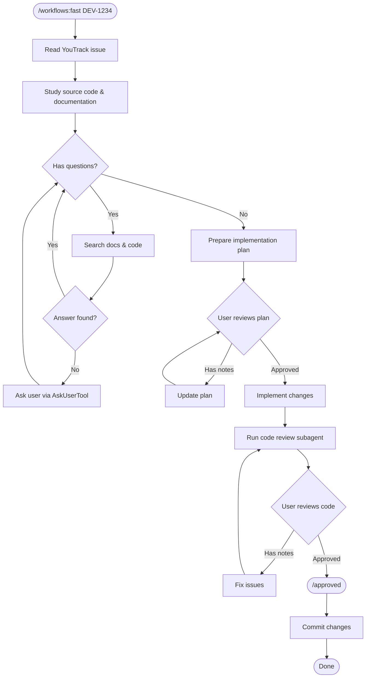

## 7. Workflows

So, here is the main part of this guide describing the main workflows I use for features development.

By workflow, I mean the process in which I interact with Claude Code when working on specific tasks. This section focuses on feature development workflows, including code review. Other workflows — such as documentation generation and requirements gathering — are outside the scope of this guide and may be covered in future articles.

I've created a set of Claude Code commands that initiate these workflows and that are used during the implementation. 

Each workflow I build has the following high-level steps:

* Gathering relevant context
* Clarifying uncertainties
* Building an implementation plan
* Reviewing the implementation plan
* Implementing the task based on the verified plan
* Reviewing the implementation
* Committing the result

Let me explain with examples. 

### Choosing between workflows

There's no well-defined criterion for choosing between fast and full workflows. It comes down to intuition: if I'm confident that Claude Code will deliver a good result with the fast workflow, I use it. Otherwise, I use the full workflow. This intuition develops over time as you apply these workflows to different tasks and learn what works for your project.

### 7.1 Fast workflow

Fast workflow is initiated just with one command:

`/workflows:fast <issueId>`

This workflow is used for pretty clear and pretty straightforward tasks:

* That may be fully implemented just by examples in the source code base, and does not require a lot of changes/additions
* simple bug fixes
* etc

I can also provide some additional info to the command, like:

* `/workflows:fast DEV-1234 See component X implementation and implement in the same way`
* `/workflows:fast DEV-1234, likely the defect occurs due to ...`

The prompt for the command is pretty simple. If some project details are skipped, it's like:

```markdown
1) Find YouTrack issue id from $ARGUMENTS
2) Read the issue description, all comments, and all attachments
3) Carefully review the existing source code base to understand the problem
4) In case you have questions, try to find the answers in the issue description, in the source code, and in the project documentation
5) Use `AskUserTool` (a built-in Claude Code tool for asking clarification questions) if you have questions. If you have no questions, just skip this step.
6) Prepare the implementation plan and present it to the user
7) In case the user has notes, update the plan and present it again
8) Start implementation after explicit approval only
9) Use code review subagents before providing the result to the review
10) When everything is ready, ask the user to review the update
```

So, this prompt acctually builds the following process:




Claude Code will read the specified task tracker issue, and, along with project documentation, will use it to understand and solve the problem.

In this workflow, I'm covering my constraint of having full control over implementation by reviewing the implementation plan prepared by Claude Code. This implementation plan is currently printed just to the Terminal, so I can efficiently review it for minor changes.

When the implementation is complete, I call `/approved` command (a custom slash command I created), which triggers Claude Code to run code review subagents and prepare the commit.

This type of workflow has a great opportunity to be automated in the future, like the following:

* The issue is created in YouTrack
* Claude Code is tagged
* Claude Code prepares the implementation plan for the update and updates the issue status
* The developer reviews it, and after all the notes are fixed, the developer accepts it
* Claude Code implements the update and creates a merge request
* A temporary environment is launched where this update can be verified before merging into the main branch

### 7.2 Full workflow

And this is the main workflow that I'm using on the project. I'll describe the main parts of it.

#### 7.2.1 Feature directory

I create a feature directory for each task I'm working on. All the feature directories are located in the `/features` directory of the monorepo. The name of the feature directory is the identifier of the issue in the task tracker.

```
monorepo
|_features
  |_DEV-1456
  	|_implementation-plan.md
  	|_to-do.md
  |_...
```

Each feature directory basically has the following documents. 

* implementation-plan.md
* to-do.md

It can also have additional files - additional documents, images, UML diagrams, generally, everything that Claude Code might use for task implementation.

After the task is completed, the feature directory stays in git history—Claude Code can reference it for future updates. Some artifacts may also be copied to the source code module itself as documentation.

#### 7.2.2 Implementation plan

The implementation document describes the main implementation decisions. It has as few details as required for successful task implementation. 

For bigger tasks, I'm preparing UML diagrams, referencing them in the implementation plan, and adding clarifications needed. In most scenarios, I add clarifications just to UML diagram (using notes) and skip implementation plan creation.

For smaller tasks, I can skip the implementation plan as well and write some details just in the to-do document.

#### 7.2.3 To-do document

This is the main feature directory document containing the implementation plan decomposed into subtasks. Each subtask (D-1, D-2, etc.) contains a checklist of steps for Claude Code to implement.

Each subtask has its own identifier, which is used further for quick reference.

Example of simple to-do document.

```markdown
## DEV-1234. Implement debug mode

### D-1. DebugModeConfiguration entity & service

- [x] create entity
- [x] implement unit tests
- [x] create database migration and apply it
- [x] repository for the entity
- [x] Create DebugModeConfigurationService service
- [x] Create unit tests for service
- [x] Commit without review

...

### D-4. Activation strategy

- [x] implement activation strategy class
- [x] update monolog config to use it
- [x] create unit tests
- [x] integration test: verify that configuration actually applied to the container
- [x] Wait for review
- [x] Commit

...
```

Some notes:

* This to-do document is created as an addendum to the implementation plan or UML diagram, so it doesn't have detailed information;
* For the unit tests, I'm just briefly describing the scenarios that should be tested
* Subtasks may have nested structure - usually, when a subtask involves the update of several application components (backend, frontend, mobile app, etc); in that case, they have identifiers like D-2.1, D-2.2.
* Depending on the task size and on how typical it is, I can explicitly specify that this subtask can be committed just after it's implemented. Review is skipped for pretty straightforward tasks that were previously successfully implemented without issues several times. (Potential issue can be caught during code review in GitLab UI)

##### How is subtask size chosen?

So, as was mentioned previously, my target is to implement each subtask within a single context window, so I could be guided just by this constraint - decompose to the size that Claude Code is capable of implementing within a single context window.

But basically, I'm just splitting the task into the set of subtasks as I previously did by applying continuous integration practices. One subtask - one small meaningful commit.

#### 7.2.4 Implementation solution & to-do documents review commands

I built two commands that are used for the validation of my inputs before the actual implementation is run:

* implementation solution review
* to-do checklist review

These commands are run when the implementation plan/to-do document/UML diagram/other inputs are ready.

##### Implementation solution review command

`/workflows:full:review-solution DEV-1234`

The goal of this command is to verify if the designed implementation matches patterns used in the project, naming standards, design principles, etc. Also, it verifies if the implementation covers all the requirements.

##### To-do document review

 `/workflows:full:review-todo DEV-1234`

This command reads the original requirements from the task tracker and checks that the implementation plan and to-do document cover all requirements completely. Also, it verifies that the order of implementation is optimal. This catches missing items or misunderstood requirements early, before any code is written.

This is an example of successful review output:

```json
Verification Results for DEV-1234

✅ Verification Passed

YouTrack Requirements Covered:
- ✓ Deep Link Handling - covered in T-4.3 Deep Linking
- ✓ First Invitation (account creation) - covered in I-4 Team Invitation First-time
  scenario
- ✓ Invalid Token error handling - covered in I-4.1 (ResourceNotFoundException)
- ✓ Token Reuse error - covered in I-4.1 (InvitationCodeAlreadyAcceptedException)
- ✓ Token Expiration - covered in I-4.1 (InvitationCodeExpiresException)

Critical Components Present:
- ✓ Database migrations - I-2 (TeamInvitationCode::project), I-3.1 (SessionToken
  entity)
- ✓ Backend entities & services - AuthenticationService,
  TeamInvitationAcceptanceService
- ✓ Symfony security integration - I-3.2 with authenticator configuration
- ✓ API controllers - AuthenticationController, TeamInvitationAcceptanceController
- ✓ Client App API service - T-4.2 (teamInvitationService)
- ✓ UI screens - InvitationScreen, LandingScreen
- ✓ Deep linking - T-4.3 with preference storage and banner

Task Order:
- ✓ Logical order: package rename → entity/migration → authentication → team
  invitation → frontend
- ✓ Backend API completed before frontend implementation
- ✓ Migrations before code using new schema

Scope:
- ✓ To-do correctly scopes to Use Case 1 only (first-time/account creation)
- ✓ Use Case 2 deferred to DEV-1235 as specified

The to-do list is structurally complete. Claude Code can proceed with
implementation using existing patterns and skills.
```


Here is the output of the command that highlights some issues

```
✅ What's Good

Logout (L-1) - Complete:
- Backend: AuthenticationService.deleteSession, UseCases, Controller (DELETE /clientapp/logout) ✓
- Frontend: ConfirmDeletePopup, Settings menu, API service ✓
- E2E tests ✓

Login (L-2) - Structure Present:
- OneTimeCode entity and repository ✓
- OneTimeCodeService (createForEmail, redeemToken) ✓
- OneTimeCodeUseCases ✓
- OneTimeCodeController ✓
- Integration tests ✓
- Frontend login screen with forms ✓

❌ Critical Missing Items

1. Missing Event System Components for Email Sending

1. The diagram shows email sending requires:
   - OneTimeCodeCreated event class
   - OneTimeCodeEventListener (subscribes to event, triggers sender)
   - OneTimeCodeSender (infrastructure - actually sends the email)

The to-do mentions "publishes event" in tests but doesn't explicitly include creating the event listener and sender. Without these, no email will be sent.

Location: After OneTimeCodeService in L-2.1

Suggested additions:
- OneTimeCodeCreated event
- OneTimeCodeEventListener.onCreated()
- OneTimeCodeSender.sendOneTimeCode() (infrastructure)
2. Two Separate API Endpoints Needed

2. Diagram shows OneTimeCodeController has TWO endpoints:
   - POST /clientapp/authentication/onetimecode (request code)
   - POST /clientapp/authentication/withonetimcode (redeem code)

The to-do just mentions "OneTimeCodeController" without distinguishing. This might be fine if Claude Code infers both methods, but it's worth noting.

⚠️ Minor Observations

- Request DTOs (RequestOneTimeCodeRequest, RedeemCodeRequest) not mentioned - Claude Code can infer these
- expiresAt not in entity diagram - appears to be calculated from createdAt + 1 hour

  ---
Recommendation: The event system components (listener + sender) are critical for the "email with login code is sent" acceptance criterion. Do you want me to add these explicitly to the to-do.md?
```

#### 7.2.5 Task implementation command

 `/workflows:full:implement DEV-1234 D-1.1` 

Where DEV-1234 is the identifier of the issue in the task tracker, and D-1.1 is the identifier of the subtask in the to-do document.

The command has the following description:

```markdown
### 1. Read Youtrack issue 

Get Youtrack issue number from $ARGUMENTS, the format is DEV-xxxx. Read Youtrack issue description, all issue comments and attachments.

### 2. Read feature documentation

1. Define the subtask identifier from $ARGUMENTS
2. Read implementation-plan.md
3. Read to-do.md
4. Read all documents starting with subtask identifier: pattern `<subtaskId>-*.md`
5. If needed, read implementation overview of previously implemented subtasks, the format is `<subtaskId>-implementation-overview.md`

### 3. Study related source code

Deeply study existing source code to understand the implementation.

### 4. Ask clarification questions

Before asking questions, try to find the answers in the projects documentation, in the requirements and in the existing source code. 

If you cannot find the answer, use `AskUserTool` to ask your questions.

### 5. Prepare the implementation plan

Based on the project documentation, task documentation, source code you studied, prepare the implementation plan and save it to `<subtaskId>-implementation-plan.md` file (separate from your task-level implementation-plan.md).

In the implementation plan:
* save all the questions you had and user's answers
* describe all classes that will be created 
* all methods that will be updated
* main technical decisions
* do not duplicate the documentation prepared in CLAUDE.md and in doc/ folders, reference these documents instead 
* mention skills you are going to use to implement specific part of your plan (write `Using skill-name, I'll implement...`)

When you create the implementation plan document, ask the user to review it and STOP. Do not make any changes before the user's approval. 
When the user has notes, read the implementation document and read all notes starting with `COMMENT: ` string, update the implementation plan and ask the user to review the updated plan. STOP, do not make any changes before explicit approval.

### 6. Implement the changes

When the plan is explicitly approved by user, implement all the changes. Only in case the subtask's to-do list states `Commit without review` you are allowed to create git commit. In all other scenarios - if it's not specified explicitly or specified `wait for review` - stop and ask the user to review your uncommitted changes.


### 7. Commit your changes

When you received approval - commit your changes. Use component specific skill:
* `committing-backend-changes` - for backend
* `committing-frontend-changes` - for frontend
....


### 8. Prepare implementation overview

When the changes are committed, create implementation overview. Describe the functionality implemented with the references to created / modified files. 
Do not repeat the implementation detail - just reference the files with short description of what was done.
Reference related project documentation that was used during the implementation.
File name: `<subtaskId>-implementation-overview.md`

### 9. Update to-do document and commit changes

Update to-do document - check all completed to-do items. Commit all the changes in the monorepo you did.
```

This prompt implements the following process:

```mermaid
flowchart TD
  subgraph Implementation["Implementation Phase (single subtask)"]
        Start(["/workflows:full:implement DEV-1234 D-1"]) --> ReadIssue[Read YouTrack issue]
        ReadIssue --> ReadDocs[Read to-do file and feature documentation]
        ReadDocs --> StudyCode[Study related source code]
        StudyCode --> Questions{Has questions?}

        Questions -->|Yes| FindAnswers[Search docs & code]
        FindAnswers --> AnswerFound{Answer found?}
        AnswerFound -->|No| AskUser[Ask user via AskUserTool]
        AnswerFound -->|Yes| Questions
        AskUser --> Questions
        Questions -->|No| PreparePlan[Prepare subtask implementation plan]

        PreparePlan --> UserReview{User reviews plan}
        UserReview -->|Has notes| UpdatePlan[Update plan]
        UpdatePlan --> UserReview
        UserReview -->|Approved| Implement[Implement changes]

        Implement --> CodeReview[Run code review subagent]
        CodeReview --> NeedsReview{Needs manual review?}

        NeedsReview -->|Yes| ManualReview{User reviews code}
        ManualReview -->|Has notes| FixCode[Fix issues]
        FixCode --> CodeReview
        ManualReview -->|Approved| Commit[Commit changes]

        NeedsReview -->|No, commit without review| Commit

        Commit --> Overview[Prepare implementation overview]
        Overview --> UpdateTodo[Update to-do document]
        UpdateTodo --> CommitDocs[Commit monorepo changes]
        CommitDocs --> End([Subtask done])
    end
```



So, Claude Code gathers the context using the following info:

* task tracker issue description, comments, and attachments
* task documentation 
* implementation details of the previous subtasks

To control the implementation, I'm reviewing the implementation plan prepared by Claude Code. It's saved to a separate markdown file (D-1.1-implementation.md for this example), so it's easier to review and edit it in comparison with doing this just in the Terminal.

In case something is not correct, I'm adding comments just to this markdown file, and run `/workflows:full:answered` command.

Once all the details are approved, I run Claude Code in "accept all changes" mode — accepting all tool calls without manual confirmation for each one.

> The user can execute Claude Code in the following modes (they are switched by pressing Shift+Tab in the Terminal):
>
> `normal`  - Claude Code ask the permission to make any change in the files
>
> `auto-accept` - Claude Code won't ask permission for most of the changes
>
> `plan` - Claude Code doesn't make any changes, just prints the implementation plan to the terminal; it can also be accessed with the standard `/plan` command. To make any changes, the user needs to enter `normal` or `auto-accept` mode (Claude Code offers this when the plan is complete).
>
> Claude Code can also be run with the --dangerously-skip-permissions flag (`claude --dangerously-skip-permissions`). In that mode, it makes all the changes without any asking.
>
> By `accept all changes mode` above, I mean `auto-accept` mode. Usually, I run Claude Code in this mode only and rarely using `plan` mode - Claude Code follows my prompt to ask the questions, do not start implementation until an explicit command is received. But this is my personal preference.


What's important here is that the development of each task starts with an empty context. Claude Code can recreate all context for every next task based on the documents in the feature directory. In that way, all the tasks can be accomplished within a single context window. (Again, this is not a hard rule; it's just my own constraint.)

The implementation overview serves as a bridge between subtasks. Since each subtask starts with a fresh context (`/clear`), Claude Code reads the implementation overviews from previous subtasks to understand what was already built. This allows it to continue working without needing the full conversation history from earlier sessions.

Here is a demonstration of how Claude Code gathers the context in this workflow:

```

/workflows:full:implement is running… DEV-1234 L-1.2

⏺ Read(features/DEV-1234/to-do.md)
⎿  Read 103 lines

⏺ Search(pattern: "features/DEV-1234/*.md")
⎿  Found 6 files (ctrl+o to expand)

⏺ Let me read all the related documentation and the CLAUDE.md files for backend and frontend.

⏺ Read(features/DEV-1234/L-1.1-implementation-plan.md)
⎿  Read 115 lines

⏺ Read(features/DEV-1234/L-1.1-implementation-overview.md)
⎿  Read 78 lines

⏺ Read(features/DEV-1234/L-0-implementation-plan.md)
⎿  Read 111 lines

⏺ Read(frontend/CLAUDE.md)
⎿  Read 51 lines

⏺ Read(backend/CLAUDE.md)
⎿  Read 168 lines

⏺ youtrack - get_issue (MCP)(issueId: "DEV-1234")
⎿  {                                                                                      
"customFields": [
{
… +177 lines (ctrl+o to expand)

⏺ youtrack - get_issue (MCP)(issueId: "DEV-1233")
⎿  {                                                                                      
"customFields": [
{
… +260 lines (ctrl+o to expand)

⏺ Let me read DEV-1235 (Settings Screen) for more context on the menu requirements, and explore the existing frontend code structure.

⏺ youtrack - get_issue (MCP)(issueId: "DEV-1235")
⎿  {
....
```

#### 7.2.6 Examples

So, basically, all my workflows are built on top of these `/workflows:fast`, `/workflows:full:*` commands. The inputs to the workflows might be different based on the type and size of the task. 

In general, I'm just choosing the form of task presentation that is most convenient to me to think about and design the implementation. This is not related to the Claude Code specific constraints that I found (so you can experiment with the inputs you usually use for your tasks).

Here are several examples:

##### Small-sized and medium-sized tasks that are pretty typical for the project

An implementation plan in that scenario is usually not prepared, and some implementation notes are added just to the to-do.md file.

````markdown
### P-1. Preferences configuration

#### P-1.1 Frontend. Create feature toggle

- [x] Create ToggledFeature::PREFERENCES_PAGE (for isDefaultTeam)
- [x] Commit

#### P-1.2 Backend. Create a preferences API method

- [x] Create enum DisplayTasksFilter.php with values: TODAY, PAST_DUE, NO_DUE_DATE, ALL
- [x] Create src\Preferences\Preferences\Domain\Preferences.php (+ repository)

```
- $showCompletedTasks: true;
- $displayListOfTasksInStatus: "DUE_TODAY"
```

- [x] Create migration and execute
- [x] Create API POST /preferences - Api, Application (for isDailyMailEnabled use DailyMailService):
  - create PreferencesService
  - use DailyMailService for isDailyMailEnabled
  - create PreferencesPresenter
  - create PreferencesUseCase

```json
{
  "isDailyMailEnabled": true,
  "showCompletedTasks": true,
  "displayListOfTasksInStatus": DisplayTasksFilter,
}
```

- [x] Create PreferencesApiTest::testSavePreferences - 1 test
- [x] Update /me

```json
{
  ...,
  "_preferences": {
    "showCompletedTasks": true, // default false
    "displayListOfTasksInStatus": "DUE_TODAY" // default "DUE_TODAY"
  }
}
```

- [x] Update integration test for GET /me method to test _preferences (1 test for default values and 1 test for customized values)
- [x] Wait for review
- [x] Commit

#### P-1.3 Frontend. Create preferences page
...

#### P-1.4 Mobile App. Create preferences screen
...
````

##### Medium-large sized task

The implementation plan is prepared by me, for some parts of it, I may have a conversation with Claude Code for brainstorming different ideas and implementation options. Then it prepares a summary that I just paste into the implementation plan.

The structure usually is the following:

````markdown
## DEV-1234. Task Name

Package: src/Contacts/BulkImport

### API method for downloading CSV template

GET /contacts/bulk/template.csv will return CSV file template with all possible columns. Generate the document on the fly just in the controller.

### API method for CSV file uploading

POST /contacts/bulk/import

Example of request:
```json
{
  ... 
}
```

Classes:

**Application/ContactsCsvParser**

Responsibilities:
* parses input CSV into PHP array of array{ firstName: string, lastName: string, ... }
* validates max rows requirement (with validation exception in case of issue)
* validates that firstName and lastName are present and have values
* validates extra columns

Unit tests:
* valid CSV parsing
* missing first name column - validation exception
* CSV file with extra column - validation exception
* ...

**Application/BulkContactsImporter**

Responsibilities:
....
````

Notes:

* I'm currently preparing the list of unit test scenarios on my own. Previously, it was prepared by Claude Code, and sometimes the tests were too detailed. It's definitely possible to tune it to write a good set of unit and integration tests. But I've decided that providing exact scenarios for unit and integration tests is also a good form of documentation for Claude Code.

* The issue description in the task tracker already has detailed information regarding requirements about required columns in the CSV file, so the implementation plan does not duplicate these requirements, but references them. Claude Code understands such references well, though referencing requirements by their ID should work even better for complex requirements. 

##### Large-sized tasks

For complex tasks involving significant architectural changes, I prepare UML class diagrams for backend implementation. The implementation plan serves as an appendix to the UML documents, describing solutions that aren't obvious from the diagrams alone. Usually, UML is enough, and the implementation plan is skipped - I can add all clarifications needed with notes to a class diagram.

The UML file is provided in two forms: as an image (PNG) and in XML format. Claude Code can analyze both — the image for visual understanding and the XML for extracting exact method signatures and argument names.

I use Visual Paradigm for UML—its CLI commands allow automated export to PNG and XML, which integrates well with Claude Code. In the implementation plan, I reference diagrams using Visual Paradigm's identifier. I've created a skill (`diagram-exporting-diagram`) that runs Visual Paradigm CLI commands to generate PNG and XML files from these references.

I also use Claude Code to review UML diagrams during design — checking for consistency with existing patterns and completeness of the design.

This UML-based approach is the most effective workflow I've found for complex tasks—it deserves a dedicated article, which I plan to write in the future. The to-do document in this case becomes quite simple — just referencing names of classes presented on the diagram and lists test scenarios:

````markdown
## DEV-1234. Sharing Client Portal Access

Diagram: ClientApp, package Access

### T-1. Backend API

- [ ] ClientAppAccess, repository, migration
- [ ] ClientAppAccessService. Unit Tests:
  - [ ] creates ClientAppAccess when not exist
  - [ ] publishes event
  - [ ] removes ClientAppAccess when contact is not provided
  - [ ] publishes event
- [ ] ClientAppAccessUseCases, use ProjectPermission.READ_CLIENT_PORTAL_CONFIGURATION
- [ ] ClientAppAccessPresenter
- [ ] ClientAppAccessController + integration tests
  - [ ] test that data is created
  - [ ] test that existing records are removed
- [ ] Implement ClientPortalAccessEventListener with 1 unit test and 1 integration test for this logic
- [ ] wait for review
- [ ] commit

...
````

Claude Code reads the diagram and fills in the implementation details — class properties, method signatures, relationships — based on what it sees in the UML.

### 7.3 Code review

Code review is a cross-cutting concern that applies to all workflows described above. It's implemented via dedicated subagents (`backend-code-reviewer`, `frontend-code-reviewer`, `mobile-code-reviewer` — see Building Blocks section).

The workflows are set up in a way that code review subagents are called automatically:
- Before providing results for my review
- Before committing the result (for "commit without review" subtasks)

Since subagents run in their own context window, the reviewer is not biased by the decisions made during implementation — it evaluates the code independently.

Additionally, code review with Claude Code is integrated into the commit-stage CI pipeline, providing an extra layer of verification before changes are merged.

### 7.4 Working on subtasks in parallel

To speed up the implementation of the task, I run several subtasks in parallel. In general, Claude Code documentation recommends using git worktrees:

* https://code.claude.com/docs/en/common-workflows#run-parallel-claude-code-sessions-with-git-worktrees

This is the best way to do this. But on my project, currently, this approach is not used because of the backend app integration tests design — I currently cannot run multiple instances of integration test environments on my local machine.

Instead, I run multiple Claude Code instances in separate terminal tabs within my IDE. Each tab is named with the YouTrack issue ID or subtask ID for easy tracking. Usually, 2-3 instances run in parallel during the development phase.

Since my monorepo is a wrapper directory containing separate git repos for each component (backend, frontend, infrastructure), parallel instances working on different components don't conflict — each commits to its own repository.

For coordination:
- I order subtasks carefully so parallel ones don't have dependencies
- When a subtask depends on another that's still in progress, I can proceed with the assumption that the API will be implemented as described in the requirements
- If all subsequent subtasks are blocked by the current one, I work on documentation for the next task instead

While multiple Claude Code instances could technically work in parallel and commit to the same repo (working on different files), I don't practice this to avoid potential conflicts.
